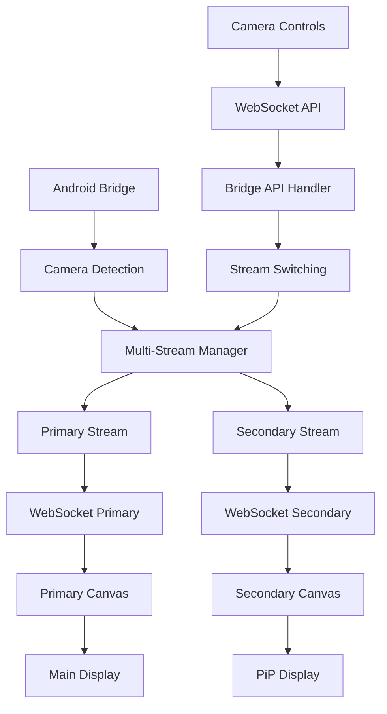

# DJI H20N Multi-Camera Integration - HANDOFF DOCUMENT

## 🚀 TLDR - You Are Here

**CURRENT STATE**: **READY FOR H20N IMPLEMENTATION** - All research completed, architecture planned

**IMMEDIATE NEXT STEPS:**
1. **🎥 HIGH PRIORITY: Implement H20N camera detection in Android bridge** - Add multi-camera discovery and metadata transmission
2. **🖥️ HIGH PRIORITY: Create H20NDisplay.tsx component** - Secondary camera display with picture-in-picture functionality
3. **📡 MEDIUM: Add camera switching WebSocket API** - Enable seamless FPV ↔ H20N transitions
4. **🎛️ MEDIUM: Implement H20N sensor switching** - Wide/Zoom/Infrared lens selection controls

**CONTEXT**: DJI SDK V5 fully supports H20N multi-sensor gimbal camera. System architecture ready for dual-camera concurrent streaming with picture-in-picture display.

---

## 📍 **CURRENT STATUS - IMPLEMENTATION READY**

### ✅ **Research Completed**
- **DJI SDK V5 Multi-Camera Support:** CameraStreamManager handles multiple simultaneous streams
- **H20N Gimbal Camera Confirmed:** Zenmuse H20N explicitly supported in DJI SDK
- **Multi-Sensor Capabilities Documented:** Wide/Zoom/Infrared/Rangefinder sensor types identified
- **Architecture Planned:** Dual-stream system with picture-in-picture display designed

### 🎯 **H20N Capabilities Confirmed**
- **Wide-Angle Camera:** General purpose imaging (CameraVideoStreamSourceType.WIDE_CAMERA)
- **Zoom Camera:** Up to 20x optical zoom (CameraVideoStreamSourceType.ZOOM_CAMERA)
- **Infrared Thermal Camera:** Heat signature detection (CameraVideoStreamSourceType.INFRARED_CAMERA)
- **Laser Rangefinder:** Distance measurement via DJI camera keys
- **Simultaneous Operation:** Multiple sensors can be active concurrently

### 🔍 **Technical Foundation**
- **Component Identification:** H20N uses ComponentIndexType.LEFT_OR_MAIN
- **Stream Management:** ICameraStreamManager.AvailableCameraUpdatedListener for detection
- **Lens Switching:** CameraVideoStreamSourceType enum for sensor selection
- **Backward Compatibility:** Single FPV camera operation preserved when H20N absent

---

## 🎯 **IMPLEMENTATION PRIORITY**

### **Phase 1: Android Bridge Multi-Camera Support**

**Goal:** Detect and manage FPV + H20N cameras simultaneously

**Current Bridge State:**
- ✅ Single FPV camera stream working (ComponentIndexType.FPV)
- ✅ H.264 video streaming established
- ❌ No multi-camera detection
- ❌ No H20N camera support

**Implementation Steps:**

1. **Camera Detection System** (DJIBridgeServer.kt):
   ```kotlin
   private val availableCameras = mutableSetOf<ComponentIndexType>()
   private val availableCameraListener = object : ICameraStreamManager.AvailableCameraUpdatedListener {
       override fun onAvailableCameraUpdated(cameras: List<ComponentIndexType>) {
           availableCameras.clear()
           availableCameras.addAll(cameras)
           sendCameraMetadata()
       }
       
       override fun onCameraStreamEnableUpdate(map: Map<ComponentIndexType, Boolean>) {
           sendCameraStatusUpdate(map)
       }
   }
   ```

2. **Multi-Stream Management:**
   ```kotlin
   private val cameraStreams = mutableMapOf<ComponentIndexType, ICameraStreamManager.ReceiveStreamListener>()
   private var primaryCamera = ComponentIndexType.FPV
   private var secondaryCamera: ComponentIndexType? = null
   
   private fun setupCameraStream(cameraIndex: ComponentIndexType, isPrimary: Boolean) {
       val listener = ICameraStreamManager.ReceiveStreamListener { data, offset, length, info ->
           val streamType = if (isPrimary) "primary" else "secondary"
           sendH264Frame(data, offset, length, info, cameraIndex.name, streamType)
       }
       cameraStreams[cameraIndex] = listener
       MediaDataCenter.getInstance().cameraStreamManager.addReceiveStreamListener(cameraIndex, listener)
   }
   ```

3. **H20N Sensor Detection:**
   ```kotlin
   private fun getH20NSensors(cameraIndex: ComponentIndexType): List<CameraVideoStreamSourceType> {
       if (cameraIndex != ComponentIndexType.LEFT_OR_MAIN) return emptyList()
       val lensKey = CameraKey.KeyCameraVideoStreamSourceRange.create(cameraIndex)
       return keyManager.getValue(lensKey) as? List<CameraVideoStreamSourceType> ?: emptyList()
   }
   ```

4. **Enhanced Metadata Transmission:**
   ```kotlin
   "cameras" to mapOf(
       "available" to availableCameras.map { it.name },
       "primary" to primaryCamera.name,
       "secondary" to secondaryCamera?.name,
       "h20n_present" to availableCameras.contains(ComponentIndexType.LEFT_OR_MAIN),
       "h20n_sensors" to if (availableCameras.contains(ComponentIndexType.LEFT_OR_MAIN)) {
           getH20NSensors(ComponentIndexType.LEFT_OR_MAIN).map { it.name }
       } else emptyList(),
       "h20n_active_sensor" to getCurrentH20NSensor()
   )
   ```

**Success Criteria:**
- Bridge detects FPV + H20N cameras when present
- Metadata includes camera availability and capabilities
- Backward compatibility: single FPV operation when H20N absent
- Concurrent dual-camera streaming operational

### **Phase 2: Desktop Interface - H20NDisplay Component**

**Goal:** Create dual-camera display with picture-in-picture functionality

**Current Desktop State:**
- ✅ FPVDisplay component working with single stream
- ✅ Video decoding via WebCodecs API
- ✅ Professional DJI-style overlays
- ❌ No secondary camera display
- ❌ No picture-in-picture functionality

**Implementation Steps:**

1. **H20NDisplay Component Creation** (src/components/H20NDisplay.tsx):
   ```typescript
   interface H20NDisplayProps {
       className?: string;
       children?: React.ReactNode;
       streamData?: {
           primary: H264StreamData;
           secondary?: H264StreamData;
       };
       activeSensor: 'wide' | 'zoom' | 'infrared';
       onSensorSwitch: (sensor: string) => void;
       h20nMetadata?: H20NMetadata;
   }
   
   export const H20NDisplay: React.FC<H20NDisplayProps> = ({
       className,
       children,
       streamData,
       activeSensor,
       onSensorSwitch,
       h20nMetadata
   }) => {
       // Dual canvas system: primary + secondary (PiP)
       // H20N-specific overlays and controls
   };
   ```

2. **Dual Video Renderer:**
   ```typescript
   // Shared video decoding logic
   const useVideoDecoder = (streamData: H264StreamData, canvasRef: RefObject<HTMLCanvasElement>) => {
       // WebCodecs decoder implementation
       // Frame buffering and rendering
   };
   
   // Primary + Secondary canvas management
   const primaryCanvasRef = useRef<HTMLCanvasElement>(null);
   const secondaryCanvasRef = useRef<HTMLCanvasElement>(null);
   
   useVideoDecoder(streamData.primary, primaryCanvasRef);
   if (streamData.secondary) {
       useVideoDecoder(streamData.secondary, secondaryCanvasRef);
   }
   ```

3. **Picture-in-Picture Layout:**
   ```typescript
   // Main camera view (FPV or H20N based on active selection)
   <canvas 
       ref={primaryCanvasRef}
       className="w-full h-full absolute top-0 left-0"
   />
   
   // Secondary camera preview (bottom-right corner)
   {streamData.secondary && (
       <canvas 
           ref={secondaryCanvasRef}
           className="absolute bottom-4 right-4 w-64 h-48 border-2 border-dji-blue rounded cursor-pointer"
           onClick={handleCameraSwap}
       />
   )}
   ```

4. **H20N Sensor Selection Controls:**
   ```typescript
   <H20NSensorControls
       availableSensors={h20nMetadata?.sensors || []}
       activeSensor={activeSensor}
       onSensorChange={onSensorSwitch}
       className="absolute top-4 right-4 z-30"
   />
   ```

**Success Criteria:**
- Dual-camera display with smooth PiP functionality
- Camera swap via secondary canvas click
- H20N sensor switching controls
- Shared video decoding infrastructure

### **Phase 3: Camera Switching API & Controls**

**Goal:** Seamless camera and sensor switching via WebSocket API

**Implementation Steps:**

1. **WebSocket API Extensions:**
   ```typescript
   // Camera switching endpoint
   {
       type: 'camera_switch',
       payload: {
           primary: 'fpv' | 'h20n',
           secondary?: 'fpv' | 'h20n'
       }
   }
   
   // H20N sensor switching
   {
       type: 'h20n_sensor_switch',
       payload: {
           sensor: 'wide' | 'zoom' | 'infrared'
       }
   }
   ```

2. **Android Bridge API Handlers:**
   ```kotlin
   private fun handleCameraSwitch(payload: JsonObject) {
       val primary = ComponentIndexType.valueOf(payload.get("primary").asString.uppercase())
       val secondary = payload.get("secondary")?.asString?.let { 
           ComponentIndexType.valueOf(it.uppercase()) 
       }
       
       switchCameras(primary, secondary)
   }
   
   private fun handleH20NSensorSwitch(payload: JsonObject) {
       val sensor = CameraVideoStreamSourceType.valueOf(payload.get("sensor").asString.uppercase())
       switchH20NSensor(sensor)
   }
   ```

3. **Desktop Camera Controls:**
   ```typescript
   <CameraSwitchPanel
       availableCameras={bridgeData.cameras?.available || []}
       primaryCamera={bridgeData.cameras?.primary}
       secondaryCamera={bridgeData.cameras?.secondary}
       onCameraSwitch={handleCameraSwitch}
       h20nPresent={bridgeData.cameras?.h20n_present}
   />
   ```

---

## 🔧 **TECHNICAL ARCHITECTURE**

### **Current vs Multi-Camera System:**

**Current (Single FPV):**
```
FPV Camera → CameraStreamManager → videoStreamListener → WebSocket → FPVDisplay
```

**Multi-Camera (H20N Integration):**
```
┌─── FPV Camera ────────────┐
│                           ▼
│     CameraStreamManager ──► Multi-Stream Manager ──► WebSocket ──► Dual Display
│                           ▲                                          │
└─── H20N Camera ──────────┘                                          │
     ├─ Wide Sensor                                                    │
     ├─ Zoom Sensor                                         ┌─────────┴─────────┐
     └─ Infrared Sensor                                     │                   │
                                                            ▼                   ▼
                                                    Primary Canvas      Secondary Canvas
                                                    (Main View)         (PiP Preview)
```

### **Data Flow Architecture:**



### **Component Structure:**

```
App.tsx
├── FPVDisplay (FPV-only mode)
└── H20NDisplay (Multi-camera mode)
    ├── Primary Video Canvas
    ├── Secondary Video Canvas (PiP)
    ├── Camera Switch Controls
    ├── H20N Sensor Controls
    └── Shared Overlays
        ├── HSI Compass
        ├── Flight Display (HUD)
        ├── Map Display
        └── Telemetry Overlays
```

---

## 📋 **IMPLEMENTATION CHECKLIST**

### **Phase 1: Android Bridge (DJIBridgeServer.kt)**
- [ ] Add ICameraStreamManager.AvailableCameraUpdatedListener
- [ ] Implement multi-camera detection logic
- [ ] Create dual-stream management system
- [ ] Add H20N sensor detection and switching
- [ ] Enhance metadata transmission with camera info
- [ ] Add WebSocket API handlers for camera switching
- [ ] Test backward compatibility (FPV-only operation)

### **Phase 2: Desktop Interface**
- [ ] Create H20NDisplay.tsx component
- [ ] Implement dual video decoder system
- [ ] Add picture-in-picture layout
- [ ] Create H20N sensor selection controls
- [ ] Add camera swap functionality (click secondary canvas)
- [ ] Integrate with existing overlay system
- [ ] Update App.tsx to conditionally render H20NDisplay

### **Phase 3: UI/UX Integration**
- [ ] Create CameraSwitchPanel component
- [ ] Add H20NSensorControls component
- [ ] Update TopBar with camera status indicators
- [ ] Add camera-specific telemetry overlays
- [ ] Implement smooth transition animations
- [ ] Add keyboard shortcuts for camera switching

### **Phase 4: Testing & Validation**
- [ ] Test FPV-only operation (H20N not present)
- [ ] Test H20N-only operation (FPV disabled)
- [ ] Test dual-camera concurrent streaming
- [ ] Validate sensor switching (Wide/Zoom/Infrared)
- [ ] Test picture-in-picture functionality
- [ ] Verify camera swap via secondary canvas click
- [ ] Performance testing with dual streams

---

## 🎯 **SUCCESS METRICS**

### **Functional Requirements:**
- ✅ Detect H20N camera presence automatically
- ✅ Maintain FPV-only operation when H20N absent
- ✅ Concurrent dual-camera streaming (FPV + H20N)
- ✅ Picture-in-picture display with camera swap
- ✅ H20N sensor switching (Wide/Zoom/Infrared)
- ✅ Professional DJI-style interface consistency

### **Performance Requirements:**
- 📊 **Video Quality:** Maintain 1920x1080 H.264 streams for both cameras
- 📊 **Latency:** <150ms end-to-end for primary camera, <200ms for secondary
- 📊 **Frame Rate:** 30fps for primary, 15-30fps for secondary (adaptive)
- 📊 **Memory Usage:** <10% increase from single-camera operation
- 📊 **CPU Usage:** Efficient dual-decoder implementation

### **UX Requirements:**
- 🎨 **Seamless Switching:** <500ms camera transition time
- 🎨 **Intuitive Controls:** One-click camera and sensor switching
- 🎨 **Visual Feedback:** Clear indicators of active camera and sensor
- 🎨 **Professional Look:** Match DJI Pilot app interface standards

---

## 📁 **KEY FILES FOR IMPLEMENTATION**

### **Critical Android Files:**
```
android-sdk-v5-sample/src/main/java/dji/sampleV5/aircraft/data/
├── DJIBridgeServer.kt                 # 🔧 Multi-camera stream management
└── DJIBridgeActivity.kt               # Bridge lifecycle management

android-sdk-v5-sample/src/main/java/dji/sampleV5/aircraft/models/
├── CameraStreamDetailVM.kt            # 📖 Reference: Camera switching logic  
└── CameraStreamListVM.kt              # 📖 Reference: Available camera detection
```

### **Critical Desktop Files:**
```
dji-controller-interface/src/
├── components/
│   ├── App.tsx                        # 🔧 Conditional H20NDisplay rendering
│   ├── FPVDisplay.tsx                 # 📖 Reference: Single camera display
│   ├── H20NDisplay.tsx                # 🆕 NEW: Dual-camera display component
│   ├── H20NSensorControls.tsx         # 🆕 NEW: Sensor switching controls
│   └── CameraSwitchPanel.tsx          # 🆕 NEW: Camera selection UI
├── hooks/
│   ├── useVideoDecoder.ts             # 🔧 Extract shared video decoding logic
│   └── useMultiCameraData.ts          # 🆕 NEW: Multi-camera data management
├── types.ts                           # 🔧 Add H20N and multi-camera types
└── bridgeManager.ts                   # 🔧 Handle multi-camera WebSocket data
```

---

## 🚨 **TECHNICAL CONSIDERATIONS**

### **Critical Implementation Notes:**

1. **Backward Compatibility:** 
   - System MUST work identically when H20N not present
   - Single FPV camera operation preserved as fallback
   - No breaking changes to existing WebSocket protocol

2. **Stream Resource Management:**
   - Secondary stream should be lower priority
   - Adaptive quality based on available bandwidth
   - Graceful degradation when network constrained

3. **Memory Management:**
   - Dual video decoders require careful memory handling
   - Canvas recycling for PiP transitions
   - Proper cleanup on camera switching

4. **WebSocket Protocol Extension:**
   - Maintain backward compatibility with existing messages
   - Add optional multi-camera metadata fields
   - Version-aware message handling

### **Known Limitations:**

- **H20N Detection:** Requires physical H20N gimbal camera connection
- **Sensor Access:** Some H20N sensors may require special permissions
- **Bandwidth:** Dual streams increase network requirements significantly
- **Hardware:** Higher CPU/GPU usage for dual video decoding

---

## 💡 **DEVELOPER HANDOFF NOTES**

### **If You're Starting This Implementation:**
1. **Begin with Phase 1:** Android bridge camera detection is foundation
2. **Test incrementally:** Verify each camera detection step before proceeding
3. **Maintain compatibility:** Test FPV-only operation throughout development
4. **Reference existing code:** CameraStreamDetailVM.kt shows sensor switching patterns

### **If You're Debugging Issues:**
1. **Check camera detection first:** Verify availableCameraListener is working
2. **Validate metadata:** Ensure camera info reaches desktop interface correctly  
3. **Monitor WebSocket traffic:** Debug dual-stream message handling
4. **Test sensor switching:** Verify H20N lens changes are applied correctly

### **Critical Dependencies:**
- **Android:** DJI SDK V5 with H20N gimbal camera physically connected
- **Network:** Sufficient bandwidth for dual H.264 streams (>10 Mbps)
- **Hardware:** Modern GPU for dual video decoding performance
- **Testing Device:** DJI controller with H20N gimbal support

---

**📝 Document Status:** Ready for implementation  
**🕒 Last Updated:** September 6, 2025  
**📍 Implementation Phase:** Phase 1 - Android Bridge Multi-Camera Support  
**🎯 Next Milestone:** H20N camera detection and dual-stream management  
**⚠️ Key Requirement:** Maintain backward compatibility with FPV-only operation